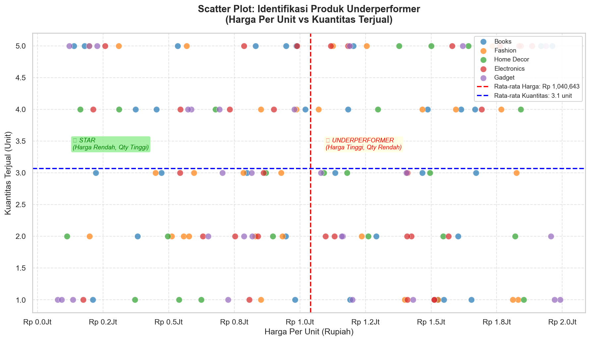
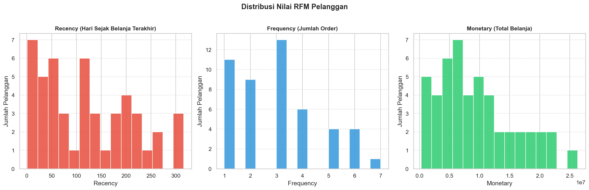
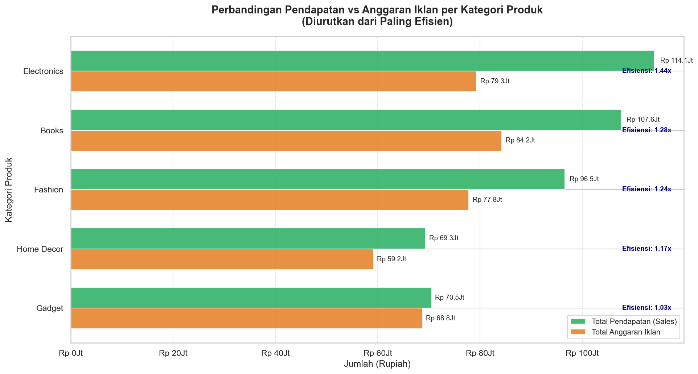
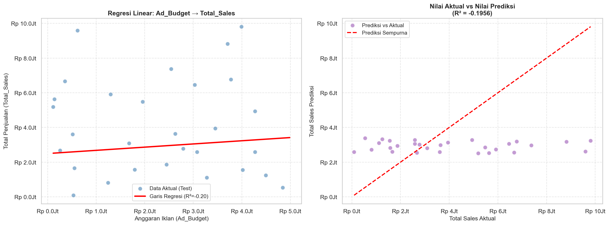

# 📊 Analisis Performa Penjualan E-Commerce
### *Optimasi Strategi Pemasaran Berbasis Data — Praktikum Analisis & Visualisasi Data*

---

> **Deskripsi Proyek**
>
> Proyek ini merupakan analisis data end-to-end terhadap dataset transaksi penjualan sebuah platform e-commerce selama tahun 2023. Tujuan utamanya adalah mengubah data mentah menjadi wawasan bisnis (*business insights*) yang dapat ditindaklanjuti, mencakup identifikasi produk bermasalah, segmentasi pelanggan berbasis perilaku, evaluasi efektivitas anggaran iklan, hingga pemodelan prediktif menggunakan regresi linear. Seluruh analisis dibangun dengan Python dan dirancang agar dapat direproduksi secara penuh (*fully reproducible*).

---

## 📁 Struktur Repositori

```
ecommercesalesdataanalisis/
│
├── data_praktikum_analisis_data.csv   # Dataset utama (150 transaksi, 8 kolom)
├── praktikum_analisis_penjualan.py    # Skrip Python utama (7 tahap analisis)
│
├── plot_underperformer.png            # Output: Scatter Plot Underperformer
├── plot_rfm_distribusi.png            # Output: Histogram Distribusi RFM
├── plot_kontribusi_kategori.png       # Output: Bar Chart Efisiensi Kategori
├── plot_regresi_linear.png            # Output: Visualisasi Model Regresi
│
└── README.md                          # Laporan ini
```

---

## ❓ Business Questions

Analisis ini dirancang untuk menjawab lima pertanyaan bisnis utama:

| # | Pertanyaan Bisnis | Metode Analisis |
|---|---|---|
| 1 | Produk mana yang memiliki harga tinggi namun kuantitas penjualan rendah (*underperformer*)? | Scatter Plot + Mean Lines |
| 2 | Siapa pelanggan terbaik berdasarkan perilaku dan nilai belanja mereka? | RFM Analysis |
| 3 | Kategori produk mana yang paling efisien dalam menggunakan anggaran iklan? | Horizontal Bar Chart |
| 4 | Apakah anggaran iklan yang lebih besar secara nyata meningkatkan total penjualan? | Uji Hipotesis (Median Split) |
| 5 | Seberapa besar pengaruh anggaran iklan terhadap prediksi total penjualan? | Regresi Linear Sederhana |

---

## 🛠️ Tech Stack


**Instalasi dependensi:**
```bash
pip install pandas matplotlib seaborn scikit-learn numpy
```

**Menjalankan analisis:**
```bash
python praktikum_analisis_penjualan.py
```

---

## 🗂️ Tentang Dataset

Dataset berisi **150 baris transaksi** e-commerce sepanjang tahun 2023 dengan skema kolom sebagai berikut:

| Kolom | Tipe Data | Deskripsi |
|---|---|---|
| `Order_ID` | Integer | ID unik setiap transaksi |
| `CustomerID` | Integer | ID unik pelanggan |
| `Order_Date` | Date | Tanggal transaksi dilakukan |
| `Product_Category` | String | Kategori produk: *Books, Fashion, Electronics, Gadget, Home Decor* |
| `Quantity` | Integer | Jumlah unit yang dibeli |
| `Price_Per_Unit` | Integer | Harga satuan produk (Rupiah) |
| `Ad_Budget` | Integer | Anggaran iklan yang dialokasikan per transaksi (Rupiah) |
| `Total_Sales` | Float | Total nilai penjualan — **kolom target utama** |

---

## 🧹 Data Wrangling

Sebelum analisis dilakukan, dataset melewati tiga tahap pembersihan data untuk memastikan kualitas dan konsistensi.

### 1. Penanganan Nilai Kosong (*Missing Values*)

Ditemukan **7 baris** dengan nilai `Total_Sales` kosong (NaN), yang kemungkinan disebabkan oleh kesalahan input atau transaksi yang belum selesai diproses. Baris-baris tersebut dihapus menggunakan `dropna()` karena kolom `Total_Sales` adalah variabel target yang tidak dapat diimputasi tanpa risiko bias.

```python
df = df.dropna(subset=['Total_Sales'])
# Hasil: 150 → 143 baris
```

### 2. Penanganan Anomali Harga (*Price Anomaly*)

Dilakukan filter untuk membuang baris dengan `Price_Per_Unit <= 0`, karena harga satuan bernilai nol atau negatif adalah tidak valid secara bisnis dan berpotensi merusak statistik deskriptif maupun model prediktif.

```python
df = df[df['Price_Per_Unit'] > 0]
```

Pada dataset ini tidak ditemukan anomali harga, sehingga jumlah baris tetap **143** setelah kedua proses di atas.

### 3. Konversi Tipe Data Tanggal

Kolom `Order_Date` yang awalnya terbaca sebagai tipe `string` dikonversi ke tipe `datetime64` menggunakan `pd.to_datetime()`. Konversi ini wajib dilakukan agar perhitungan selisih hari (*Recency* pada analisis RFM) dapat berjalan dengan benar.

```python
df['Order_Date'] = pd.to_datetime(df['Order_Date'])
```

### Ringkasan Hasil Cleaning

| Kondisi | Jumlah Baris |
|---|---|
| Sebelum cleaning | 150 |
| Setelah hapus NaN `Total_Sales` | 143 |
| Setelah filter `Price_Per_Unit > 0` | **143** (final) |

---

## 📈 Insights & Visualisasi

### Tahap 3 — Identifikasi Produk Underperformer

**Scatter Plot: Harga Per Unit vs Kuantitas Terjual**



Grafik scatter plot dibagi menjadi empat kuadran berdasarkan garis rata-rata harga (Rp 1.040.643) dan rata-rata kuantitas (3,07 unit). Fokus analisis tertuju pada **kuadran kanan-bawah**, yaitu produk dengan harga di atas rata-rata namun kuantitas terjual di bawah rata-rata — inilah zona *Underperformer*.

**Temuan utama:**
- Terdapat **40 transaksi** yang masuk ke kuadran Underperformer, tersebar di hampir semua kategori produk.
- Produk-produk di segmen ini kemungkinan mengalami hambatan penjualan akibat sensitivitas harga yang tinggi dari konsumen, atau kurangnya nilai yang dipersepsikan (*perceived value*) dibandingkan harganya.
- Sebaliknya, kuadran kiri-atas (*Star*) menunjukkan produk harga rendah dengan volume tinggi — ini adalah produk pendorong transaksi.

---

### Tahap 4 — Segmentasi Pelanggan (Analisis RFM)

**Histogram Distribusi Recency, Frequency, dan Monetary**



Analisis RFM mengevaluasi 48 pelanggan unik berdasarkan tiga dimensi perilaku belanja. Setiap pelanggan diberi skor 1–5 per dimensi menggunakan *quantile-based scoring* (`pd.qcut`), kemudian dikategorikan ke dalam segmen berikut:

| Segmen | Kriteria Skor Total | Jumlah Pelanggan | Strategi |
|---|---|---|---|
| 🏆 **Champions** | ≥ 13 | 10 | Pertahankan dengan program loyalitas eksklusif |
| 💛 **Loyal Customers** | 10–12 | 11 | Tingkatkan dengan *upselling* dan reward |
| 🌱 **Potential Loyalists** | 7–9 | 15 | Konversi dengan penawaran personal |
| ⚠️ **At Risk** | 4–6 | 9 | Reaktivasi dengan diskon atau kampanye *win-back* |
| ❌ **Lost** | < 4 | 3 | Kampanye reaktivasi terakhir atau abaikan |

**Temuan utama:**
- Sebagian besar pelanggan (26 dari 48 atau **54%**) berada di segmen *Potential Loyalists* dan *Loyal Customers*, menandakan basis pelanggan yang relatif sehat.
- Pelanggan *Champions* seperti CustomerID 5008 dan 5044 tercatat memiliki frekuensi hingga 6–7 transaksi dengan total belanja di atas Rp 20 juta — aset terpenting bisnis.
- Hanya 3 pelanggan yang benar-benar *Lost*, mengindikasikan tingkat *churn* yang masih dapat dikendalikan.

---

### Tahap 5 — Analisis Kontribusi & Efisiensi Kategori

**Bar Chart Horizontal: Pendapatan vs Anggaran Iklan per Kategori**



Efisiensi iklan diukur menggunakan **Rasio Efisiensi = Total Pendapatan / Total Anggaran Iklan**, yang menunjukkan berapa rupiah pendapatan yang dihasilkan untuk setiap satu rupiah yang diinvestasikan pada iklan.

| Peringkat | Kategori | Rasio Efisiensi | Interpretasi |
|---|---|---|---|
| 1 🥇 | **Electronics** | **1,44x** | Setiap Rp 1 iklan menghasilkan Rp 1,44 pendapatan |
| 2 🥈 | Books | 1,38x | Efisien, dengan volume transaksi tinggi |
| 3 🥉 | Fashion | 1,22x | Di atas rata-rata, perlu optimasi targeting |
| 4 | Home Decor | 1,11x | Mendekati *break-even*, perlu evaluasi |
| 5 ⚠️ | **Gadget** | **1,03x** | Hampir tidak menguntungkan dari sisi ROI iklan |

**Temuan utama:**
- **Electronics** adalah kategori paling produktif secara iklan, menandakan audiens yang responsif terhadap konten promosi elektronik.
- **Gadget** memiliki rasio efisiensi mendekati 1,0 — artinya hampir seluruh pendapatan dari Gadget hanya cukup untuk menutup biaya iklannya sendiri. Ini sinyal serius untuk meninjau ulang alokasi anggaran iklan di kategori ini.

---

### Tahap 6 — Uji Hipotesis: Efektivitas Anggaran Iklan

Data dibagi menjadi dua kelompok berdasarkan nilai median anggaran iklan (Rp 2.722.500):

| Kelompok | Rata-rata Total Sales |
|---|---|
| Iklan Rendah (< Rp 2.722.500) | **Rp 3.207.944** |
| Iklan Tinggi (≥ Rp 2.722.500) | **Rp 3.198.792** |

**Temuan utama:**
- Perbedaan rata-rata penjualan antara kedua kelompok hanya **-0,3%** — secara praktis tidak bermakna.
- Ini mengindikasikan bahwa **besar anggaran iklan saja bukan penentu utama penjualan** pada dataset ini. Faktor lain seperti kategori produk, harga, dan kualitas produk kemungkinan berperan lebih signifikan.
- Temuan ini menjadi dasar penting untuk mengkaji ulang efektivitas strategi iklan yang sedang berjalan.

---

### Tahap 7 — Model Regresi Linear Sederhana

**Visualisasi Garis Regresi & Prediksi vs Aktual**



Model regresi linear dibangun untuk memprediksi `Total_Sales` berdasarkan `Ad_Budget` dengan pembagian data 80% training dan 20% testing.

**Persamaan model yang dihasilkan:**

```
Total_Sales = 2.496.139 + 0,1842 × Ad_Budget
```

| Parameter | Nilai | Interpretasi |
|---|---|---|
| **Intercept (β₀)** | Rp 2.496.139 | Estimasi penjualan dasar saat anggaran iklan = 0 |
| **Koefisien Iklan (β₁)** | 0,1842 | Setiap kenaikan Rp 1.000.000 anggaran iklan → penjualan naik Rp 184.200 |
| **R² Score** | -0,1956 | Model tidak mampu menjelaskan variasi penjualan dari iklan saja |

**Interpretasi R² Negatif:**

Nilai R² negatif (−0,20) mengindikasikan bahwa model regresi linear dengan satu variabel (`Ad_Budget`) **lebih buruk** dari sekadar memprediksi menggunakan nilai rata-rata. Ini bukan berarti kode atau prosesnya keliru — melainkan ini adalah **temuan ilmiah yang valid**: anggaran iklan *bukan* prediktor linear yang baik untuk total penjualan pada dataset ini. Distribusi penjualan sangat dipengaruhi oleh kombinasi faktor lain (harga, kuantitas, kategori), sehingga model regresi multipel (*multiple regression*) akan memberikan hasil yang lebih akurat.

---

## 💡 Rekomendasi Bisnis

Berdasarkan seluruh temuan analisis di atas, berikut adalah empat rekomendasi konkret yang dapat diimplementasikan:

### 1. 🎯 Program Loyalitas untuk Segmen Champions & Loyal Customers
Dari 48 pelanggan, **21 pelanggan** (44%) berada di segmen *Champions* dan *Loyal Customers* dengan total belanja rata-rata di atas Rp 10 juta per pelanggan. Implementasikan program loyalitas berjenjang seperti voucher eksklusif, akses *early sale*, atau cashback tambahan khusus untuk segmen ini guna mempertahankan kontribusi revenue mereka yang signifikan.

### 2. 📉 Penyesuaian Strategi Harga untuk Produk Underperformer
Terdapat **40 transaksi** produk dengan harga di atas rata-rata namun kuantitas di bawah rata-rata. Lakukan salah satu dari dua pendekatan: **(a)** turunkan harga mendekati rata-rata pasar untuk mendorong volume, atau **(b)** perkuat *value proposition* melalui konten pemasaran yang lebih kuat agar konsumen bersedia membayar harga premium.

### 3. 📢 Realokasi Anggaran Iklan dari Gadget ke Electronics
Kategori **Gadget** memiliki rasio efisiensi iklan terendah (1,03x), sementara **Electronics** mencapai 1,44x. Pertimbangkan untuk memindahkan sebagian anggaran iklan dari Gadget ke Electronics dan Books — dua kategori dengan ROI tertinggi — untuk memaksimalkan return on ad spend (ROAS) secara keseluruhan.

### 4. 🔬 Kembangkan Model Prediktif yang Lebih Komprehensif
Mengingat R² regresi dengan satu variabel sangat rendah, rekomendasikan pengembangan **model regresi multipel** yang menyertakan variabel `Price_Per_Unit`, `Quantity`, dan `Product_Category` (sebagai *dummy variable*) sebagai fitur tambahan. Model yang lebih kaya fitur akan memberikan akurasi prediksi yang jauh lebih baik dan dapat digunakan sebagai dasar perencanaan anggaran iklan di periode berikutnya.

---

## 👤 Informasi Proyek

| | |
|---|---|
| **Mata Kuliah** | Analisis dan Visualisasi Data |
| **Jenis Tugas** | Praktikum Akhir |
| **Dataset** | Data Penjualan E-Commerce 2023 (150 transaksi) |
| **Tools** | Python 3.12, Pandas, Matplotlib, Seaborn, Scikit-learn |
| **Tahun** | 2023/2024 |

---

*Laporan ini dibuat sebagai bagian dari praktikum analisis data. Seluruh kode dapat dijalankan ulang secara independen dengan mengikuti instruksi instalasi di atas.*